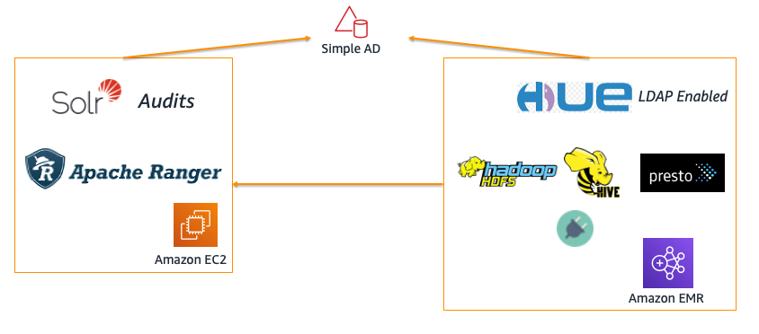

## Authorization and Auditing on Amazon EMR Using Apache Ranger

The repo provides reference architecture to deploy [Apache Ranger](https://ranger.apache.org/) on [Amazon EMR](https://aws.amazon.com/emr/). Apache Ranger is a framework to enable, monitor, and manage comprehensive data security across the Hadoop platform. 
Features include centralized security administration, 
fine-grained authorization across many Hadoop components (eg - Hadoop, Hive, HBase, Storm, Knox, Solr, Kafka, and YARN) and central auditing. 
It uses agents to sync policies and users, and plugins that run within the same process as the Hadoop component, like NameNode and HiveServer2.

The repo contains code tied to [AWS Big Data Blog](https://aws.amazon.com/blogs/big-data/implementing-authorization-and-auditing-using-apache-ranger-on-amazon-emr/).

> **NOTE:** the code has gone through unit and functional test against a **few recent versions** of Amazon EMR. 
> It is likely that it may not work with **all** EMR versions.
> Code/plugin marked as **beta** has not been suitable for production use.
>> Please submit Pull Request or to create an [Issue](https://github.com/aws-samples/aws-emr-apache-ranger/issues/new)
>
### Deployment options: 

| Module |  Architecture | Description |
| ---------------- |  --- |-------------------------------------------------------- |
| [Basic setup with LDAP](aws_emr_blog_v1) |   | Basic deployment using [AWS Simple AD](https://docs.aws.amazon.com/directoryservice/latest/admin-guide/directory_simple_ad.html), Hive and HDFS plugins and optional Presto Plugin|
| [Kerberos enabled setup with AD/LDAP](aws_emr_blog_v1) |   | Deploy a Kerberos enabled EMR cluster using Windows AD, Hive and HDFS plugins and optional Presto Plugin|

### Compatibility/Supported plugins: 
| Module|  Tag | Cloudformation stack | Apache Ranger Version | EMR Version | Supported Plugins|
| -------| --- | --- | --- | --- |-------------------------------------------------------- |
| V1 | [1.0](https://github.com/aws-samples/aws-emr-apache-ranger/tree/1.0) |  | Apache Ranger 1.0, 2.1 | emr-5.28.1, emr-5.29.0, emr-5.30.1| Hive 2.x, Hadoop 2.x, PrestoDB 0.227/0.232 (Presto plugin needs Ranger 2.0) | 
| V1 | [1.1](https://github.com/aws-samples/aws-emr-apache-ranger/tree/1.1) |  | Apache Ranger 2.2 | emr-5.29.0, emr-5.30.1, emr-6.1.0 | Hive 3.x, Hadoop 3.x, PrestoSQL 338 OR PrestoDB 0.232 | 
| V2 (Preview) | [2.0](https://github.com/aws-samples/aws-emr-apache-ranger/tree/emr-ranger-2.0) | Step1 -  Step2 -  | Apache Ranger 2.1 | emr-5.30.1 | Hive 2.x, Hadoop 2.x, PrestoDB 0.227/0.232 (Presto plugin needs Ranger 2.0) | 

> WARNING: The current V1 setup does not enable strong cluster level Auth (Kerberos) for EMR. Only LDAP enabled Hue UI. V2 will support Kerberos - refer to the [roadmap](https://github.com/aws-samples/aws-emr-apache-ranger/projects/1) for details.
### PrestoSQL Ranger plugin (EMR 6.1 & Ranger 2.2)
Shows how the plugin can be used to enable column level access controls, column masking and row filter. Demo uses the [Presto Redshift connector](https://prestosql.io/docs/current/connector/redshift.html). The same functionality should work with other [Presto connectors](https://prestosql.io/docs/current/connector.html).

Please open Git Issues if you would like to see updates/other plugin integrations. 
### References:

 - Amazon EMR: https://aws.amazon.com/emr/
 - EMRFS: https://docs.aws.amazon.com/emr/latest/ManagementGuide/emr-fs.html
 - Amazon EMR + Kerberos: https://docs.aws.amazon.com/emr/latest/ManagementGuide/emr-kerberos.html 
 - Apache Ranger: https://ranger.apache.org/
 - Apache Ranger + Amazon EMR Blog: https://aws.amazon.com/blogs/big-data/implementing-authorization-and-auditing-using-apache-ranger-on-amazon-emr/
 - Apache Ranger Presto Plugin: 
   - Code for PrestoDB plugin - [Link](https://github.com/varunrao/ranger/tree/prestodb)
   - https://cwiki.apache.org/confluence/display/RANGER/Presto+Plugin

# Reporting Bugs

If you encounter a bug, please create a new issue with as much detail as possible and steps for reproducing the bug. See the [Contributing Guidelines](./CONTRIBUTING.md) for more details.

# License

This sample code is made available under a modified MIT license. See the LICENSE file.
