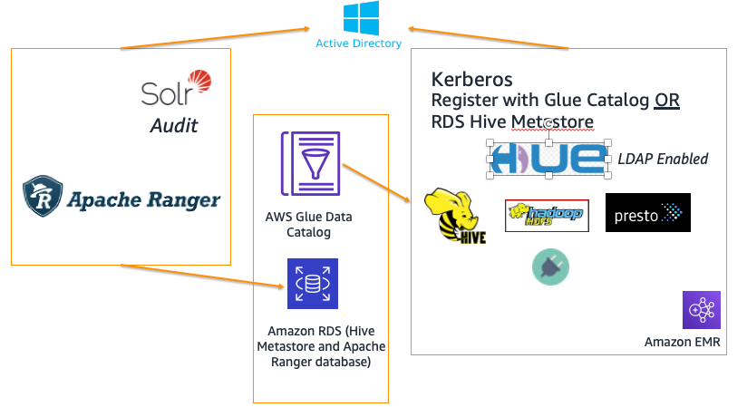
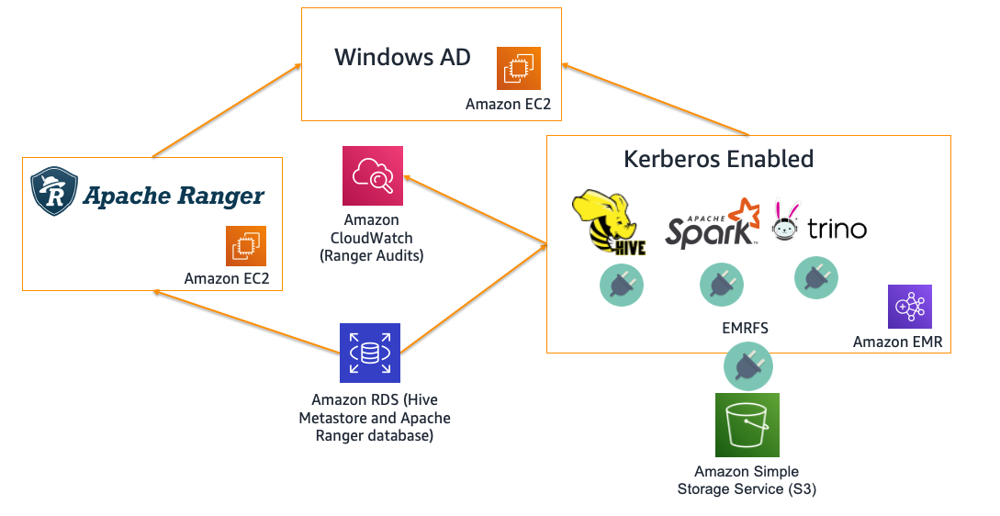

## Authorization and Auditing on Amazon EMR Using Apache Ranger

The repo provides reference architecture to deploy [Apache Ranger](https://ranger.apache.org/) on [Amazon EMR](https://aws.amazon.com/emr/). Apache Ranger is a framework to enable, monitor, and manage comprehensive data security across the Hadoop platform. 
Features include centralized security administration, 
fine-grained authorization across many Hadoop components (eg - Hadoop, Hive, HBase, Storm, Knox, Solr, Kafka, and YARN) and central auditing. 
It uses agents to sync policies and users, and plugins that run within the same process as the Hadoop component, like NameNode and HiveServer2.

The repo contains code tied to following AWS Big data blogs:
 - [Introducing Amazon EMR integration with Apache Ranger](https://aws.amazon.com/blogs/big-data/introducing-amazon-emr-integration-with-apache-ranger/)
 - [Authorize SparkSQL data manipulation on Amazon EMR using Apache Ranger](https://aws.amazon.com/blogs/big-data/authorize-sparksql-data-manipulation-on-amazon-emr-using-apache-ranger/).
 - [Enable federated governance using Trino and Apache Ranger on Amazon EMR] (**New!** - Coming soon)
 - [Implementing Authorization and Auditing using Apache Ranger on Amazon EMR](https://aws.amazon.com/blogs/big-data/implementing-authorization-and-auditing-using-apache-ranger-on-amazon-emr/)

> **NOTE:** the code has gone through unit and functional test against a **few recent versions** of Amazon EMR. 
> It is likely that it may not work with **all** EMR versions.
> Code/plugin marked as **beta** has not been suitable for production use.
>> Please submit Pull Request or to create an [Issue](https://github.com/aws-samples/aws-emr-apache-ranger/issues/new)
>
### Deployment options: 

| Module | Description| Architecture | Details |
| ------ | -------| --- |-------------------------------------------------------- |
| V2 | [Open Source Ranger Plugins with Kerberos enabled cluster and AD](aws_emr_blog_v2) |   | Deploy a Kerberos enabled EMR cluster using Windows AD, Hive and HDFS plugins and optional Presto and HBase Plugin|
| V3 | [EMR Native plugins for Spark/S3 with Kerberos enabled cluster and AD](aws_emr_blog_v3) |   | Deploy a Kerberos enabled EMR cluster with the Amazon EMR native integration of Apache Ranger - Supports Hive, Spark and Amazon S3|

### Compatibility/Supported plugins: 
| Module|  Tag | Region| Region Code | Cloudformation stack | Apache Ranger Version | EMR Version | Supported Plugins|
| -------| --- | --- | --- | --- | --- | --- |-------------------------------------------------------- |
| V2 | [2.0](aws_emr_blog_v2) | US East (Virginia)| us-east-1| Step1 - Setup VPC/AD server -      Step 2 -  Setup the Ranger Server/RDS Instance/EMR Cluster -  | Apache Ranger 2.1 | emr-5.30.1, emr-6.1.0, emr-6.2.0 | Hive 2.x, Hadoop 2.x, PrestoSQL 338/343, PrestoDB 0.227/0.232 (Presto plugin needs Ranger 2.0) | 
| V3 EMR Ranger GA Launch | [3.0](aws_emr_blog_v3) | US East (Virginia)| us-east-1| Step1 - Use this script to Upload SSL key and certs to AWS Secrets Manager [Script](aws_emr_blog_v3/scripts/emr-tls/create-tls-certs.sh)   Step2 - Setup VPC/AD server    Step 3 -  Setup the Ranger Server/RDS Instance/EMR Cluster  | Apache Ranger 2.1 | emr-5.32.0, emr-6.3.0, emr-6.4.0 | Hive 2.x, Hadoop 2.x, Spark 2.x, Hive 3.x, Hadoop 3.x, Spark 3.x | 

> WARNING: The current V1 setup does not enable strong cluster level Auth (Kerberos) for EMR. Only LDAP enabled Hue UI. V2 will support Kerberos - refer to the [roadmap](https://github.com/aws-samples/aws-emr-apache-ranger/projects/1) for details.

----

### Module V3 - Native Support of Apache Ranger on Amazon EMR 5.32+

#### Apache Spark Plugin

#### Amazon S3 Plugin

----

Please open Git Issues if you would like to see updates/other plugin integrations. 
### References:

 - Amazon EMR: https://aws.amazon.com/emr/
 - EMRFS: https://docs.aws.amazon.com/emr/latest/ManagementGuide/emr-fs.html
 - Amazon EMR + Kerberos: https://docs.aws.amazon.com/emr/latest/ManagementGuide/emr-kerberos.html 
 - Apache Ranger: https://ranger.apache.org/
 - Apache Ranger + Amazon EMR Blog: https://aws.amazon.com/blogs/big-data/implementing-authorization-and-auditing-using-apache-ranger-on-amazon-emr/
 - Apache Ranger Presto Plugin: 
   - Code for PrestoDB plugin - [Link](https://github.com/varunrao/ranger/tree/prestodb)
   - https://cwiki.apache.org/confluence/display/RANGER/Presto+Plugin

# Reporting Bugs

If you encounter a bug, please create a new issue with as much detail as possible and steps for reproducing the bug. See the [Contributing Guidelines](./CONTRIBUTING.md) for more details.

# License

This sample code is made available under a modified MIT license. See the LICENSE file.
