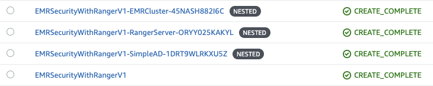

# Authorization and Auditing on Amazon EMR Using Apache Ranger - V1
The repo contains code tied to [AWS Big Data Blog](https://aws.amazon.com/blogs/big-data/implementing-authorization-and-auditing-using-apache-ranger-on-amazon-emr/) on Implementing Authorization and Auditing on Amazon EMR Using Apache Ranger

This is V1 of the blog post with the following basic setup.

- AWS managed SimpleAD server
- Apache Ranger EC2 instance with Solr
- Amazon EMR cluster with Apache Ranger plugins 
   - Apache Hive
   - HDFS
- Apache PrestoDB plugin (Optional)

| Module | Cloudformation stack | Architecture | Description |
| ---------------- | --- | --- |-------------------------------------------------------- |
| [Basic setup with LDAP](v1) |  |  | Basic Deployment using [AWS Simple AD](https://docs.aws.amazon.com/directoryservice/latest/admin-guide/directory_simple_ad.html), Hive and HDFS plugins and optional Presto Plugin|

## Cloudformation stack output

## Contents

This contains the following sub folders:

- **cloudformation:** Cloudformation scripts to setup the stack
- **inputdata:** Data files used by the scripts
- **scripts:** Scripts used for Installing Ranger and other EMR step actions

### References

 - Amazon EMR: https://aws.amazon.com/emr/
 - EMRFS: https://docs.aws.amazon.com/emr/latest/ManagementGuide/emr-fs.html
 - Amazon EMR + Kerberos: https://docs.aws.amazon.com/emr/latest/ManagementGuide/emr-kerberos.html 
 - Apache Ranger: https://ranger.apache.org/
 - Apache Ranger + Amazon EMR Blog: https://aws.amazon.com/blogs/big-data/implementing-authorization-and-auditing-using-apache-ranger-on-amazon-emr/
 - Apache Ranger Presto Plugin: https://cwiki.apache.org/confluence/display/RANGER/Presto+Plugin
