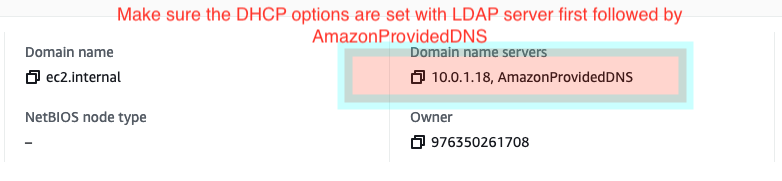

# Authorization and Auditing on Amazon EMR Using Apache Ranger 

The repo contains code tied to the AWS Big Data Blog introducing native Apache Ranger integration with Amazon EMR
The code deploys the following:

- Apache Ranger 2.0
- Windows AD server on EC2 (Creates dummy users - binduser/analyst1/analyst2)
- RDS MySQL database that is used for Apache Ranger and Hive Metastore on the EMR cluster
- Kerberos Enabled Amazon EMR cluster (EMR 5.32) with AWS Managed Ranger Plugins
     * Amazon S3
     * Apache Spark
     * Apache Hive

> **NOTE:** the code only run under us-east-1 (N. Virginia). You can copy to your regional bucket to deploy in a different region. Also, create [Issue](https://github.com/aws-samples/aws-emr-apache-ranger/issues/new) if you would like support for additional regions using this repo. 
>

### NOTE: Apache Ranger plugins and Apache Ranger Admin Server SSL Keys and Certs have to be uploaded to AWS Secrets Manager for Cloudformation scripts to work

## Cloudformation Launch Steps:

 - Use this script to Upload SSL key and certs to AWS Secrets Manager [Script](../aws_emr_blog_v3/scripts/emr-tls/create-tls-certs.sh) 
 
 - Create VPC/AD server (takes ~10 min to run) 
 
  [Not required as #25 was fixed] ~~Verify [DHCPOptions](https://docs.aws.amazon.com/vpc/latest/userguide/VPC_DHCP_Options.html) to make sure Domain Name servers for the VPC are listed in the right order (AD server first followed by AmazonProvidedDNS) - ([link](https://console.aws.amazon.com/vpc/home?region=us-east-1#vpcs:))
    - 
    - `If the order in incorrect`, update VPC's DHCPOptions using the following steps
      - Create a new DHCP option set - ([link](https://docs.aws.amazon.com/vpc/latest/userguide/VPC_DHCP_Options.html#CreatingaDHCPOptionSet))
      - Changing the set of DHCP options that a VPC uses - ([link](https://docs.aws.amazon.com/vpc/latest/userguide/VPC_DHCP_Options.html#ChangingDHCPOptionsofaVPC))~~

 - Setup the Ranger Server/RDS Instance/EMR Cluster (takes ~15 min to run)  

## Test
 - Login to the cluster (Apache Zeppelin, Hue, Livy or SSH)
 - ``> pyspark``
 - Spark access allowed by the policy: `spark.sql("select * from tblanalyst1 limit 10").show()`
 - Spark access that will fail due to permission error: `spark.sql("select * from tblanalyst2 limit 10").show()`
 - S3 access allowed by the policy: `productsFile = sqlContext.read.parquet("s3://aws-bigdata-blog/artifacts/aws-blog-emr-ranger/data/staging/products/")`
 - S3 access that will fail due to permission error: `customersFile = sqlContext.read.parquet("s3://aws-bigdata-blog/artifacts/aws-blog-emr-ranger/data/staging/customers/")`

## Architecture

## Cloudformation stack output

