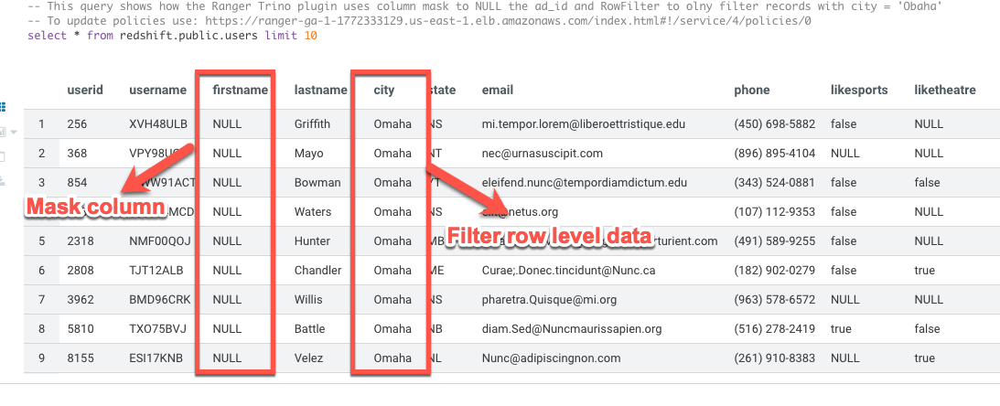
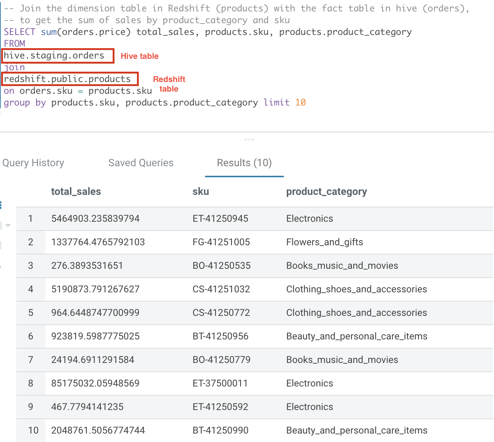
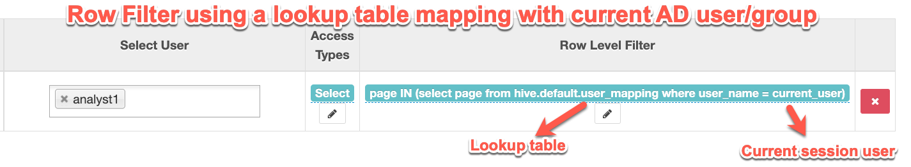

# Native Support for Authorization and Auditing on Amazon EMR Using Apache Ranger 

The repo contains code tied to the AWS Big Data Blog introducing native Apache Ranger integration with Amazon EMR
The code deploys the following:

- Apache Ranger 2.0
- Windows AD server on EC2 (Creates dummy users - binduser/analyst1/analyst2)
- RDS MySQL database that is used for Apache Ranger and Hive Metastore on the EMR cluster
- Kerberos Enabled Amazon EMR cluster (EMR 5.32) with AWS Managed Ranger Plugins
     * Amazon S3
     * Apache Hive
        * Blog - [Introducing Amazon EMR integration with Apache Ranger](https://aws.amazon.com/blogs/big-data/introducing-amazon-emr-integration-with-apache-ranger/)
     * Apache Spark
        * Blog - [Authorize SparkSQL data manipulation on Amazon EMR using Apache Ranger](https://aws.amazon.com/blogs/big-data/authorize-sparksql-data-manipulation-on-amazon-emr-using-apache-ranger/)
     * Apache Tino (> EMR 6.7)
       * Blog (**New!**) - [Enable federated governance using Trino and Apache Ranger on Amazon EMR](https://aws.amazon.com/blogs/big-data/enable-federated-governance-using-trino-and-apache-ranger-on-amazon-emr/)

> **NOTE:** the code only run under us-east-1 (N. Virginia). You can copy to your regional bucket to deploy in a different region. Also, create [Issue](https://github.com/aws-samples/aws-emr-apache-ranger/issues/new) if you would like support for additional regions using this repo. 
>

### NOTE: Apache Ranger plugins and Apache Ranger Admin Server SSL Keys and Certs have to be uploaded to AWS Secrets Manager for Cloudformation scripts to work

## Cloudformation Launch Steps:

 1. If you need to launch this stack in a region `outside US-East-1`, run the following steps, else skip to the next step.
    - Create a regional S3 bucket in your account in the target region : eg S3 Bucket in eu-north-1: test-emr-eu-north-1
    - Run the Script [setup-regional-ranger-automation.sh](../aws_emr_blog_v3/scripts/setup-regional-ranger-automation.sh) to copy the required artifacts to the regional bucket (NOTE: this only copies the Lambda code and the EMR bootstrap script)
  
 2. Create and Upload SSL keys and certs to AWS Secrets Manager. This is used to encrypt traffic between Ranger server/agents [Script](../aws_emr_blog_v3/scripts/emr-tls/create-tls-certs.sh) 
   - NOTE: DEFAULT_EC2_REALM parameter value should be "ec2.internal" if US-EAST-1 and "compute.internal" for other regions. AWS_REGION will be the other argument (eg: eu-north-1)
 3. Create VPC/AD server (takes ~10 min to run) 
    - NOTE: If you are launching this `outside US-East-1`, the `S3Bucket` parameter should be the new regional bucket you created on step 1: eg: test-emr-eu-north-1
 4. Setup the Ranger Server/RDS Instance/EMR Cluster (takes ~15 min to run)  
    - NOTE: If you are launching this `outside US-East-1`, the `S3Bucket` parameter new regional bucket you created on step 1 : eg: test-emr-eu-north-1
    - If you need to deploy each of the steps individually follow the steps below:
      - Deploy RDS instace 
      - Deploy the Ranger server 
      - Deploy the EMR server 

## (Beta) Cloudformation Launch Steps:
The code currenlty in beta removes the need to 1/ create local S3 bucket in non US-East-1 regions and 2/ create and upload certs to secrets manager. Review these issues for details (https://github.com/aws-samples/aws-emr-apache-ranger/projects/1?card_filter_query=label%3Abeta). 

Steps to deploy the Beta stack:

 1. Create VPC/AD server (takes ~10 min to run) 
    - NOTE: The 'beta' code supports multi-region deployment by creating a new regional bucket
 2. Setup the Ranger Server/RDS Instance/EMR Cluster (takes ~15 min to run)  
  - NOTE: The 'beta' code supports multi-region deployment by creating a new regional bucket. Make sure you select the following parameter values:
    - **CreateRegionalS3BucketAndCopyScripts: 'true'** -- Will create a regional bucket and copy the required files
    - **CreateTLSCerts: 'true'** -- Will create self-signed certs and upload to Secrets manager
    

## Test
 - Login to the cluster (Apache Zeppelin, Hue, Livy or SSH)
    - ``> pyspark``
 - Spark access allowed by the policy: `spark.sql("select * from tblanalyst1 limit 10").show()`
 - Spark access that will fail due to permission error: `spark.sql("select * from tblanalyst2 limit 10").show()`
 - S3 access allowed by the policy: `productsFile = sqlContext.read.parquet("s3://aws-bigdata-blog/artifacts/aws-blog-emr-ranger/data/staging/products/")`
 - S3 access that will fail due to permission error: `customersFile = sqlContext.read.parquet("s3://aws-bigdata-blog/artifacts/aws-blog-emr-ranger/data/staging/customers/")`

## Architecture

## Cloudformation stack output

## Features support by Amazon EMR Trino Plugin

### Row filter and column masking

### Authorize calls to trino connectors

### Dynamic row filters based on lookup table and user session

