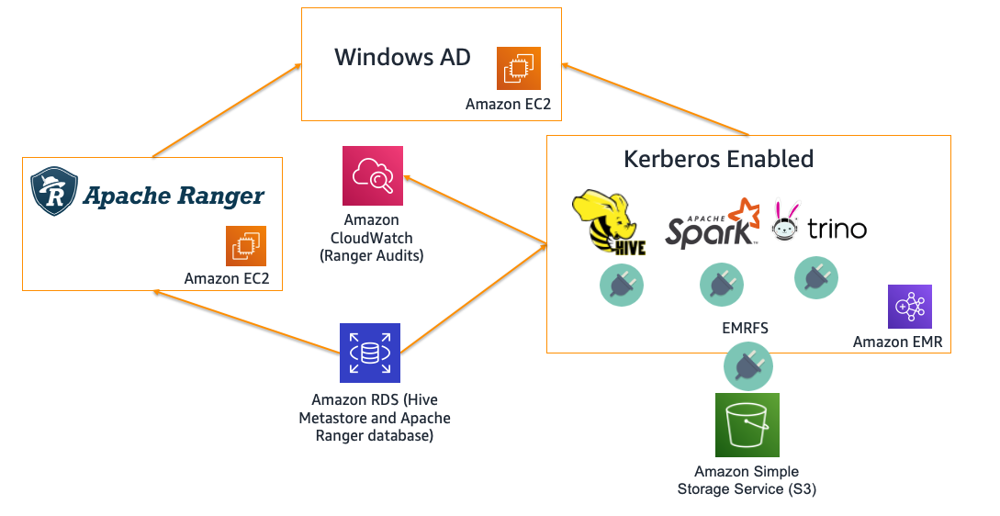

# Authorization and Auditing on Amazon EMR Using Apache Ranger 

The repo contains code tied to the AWS Big Data Blog introducing native Apache Ranger integration with Amazon EMR
The code deploys the following:

- Apache Ranger 2.0
- Windows AD server on EC2 (Creates dummy users - binduser/analyst1/analyst2)
- RDS MySQL database that is used for Apache Ranger and Hive Metastore on the EMR cluster
- Kerberos Enabled Amazon EMR cluster (EMR 5.32) with AWS Managed Ranger Plugins
     * Amazon S3
     * Apache Spark
     * Apache Hive

> **NOTE:** the code only run under us-east-1 (N. Virginia). You can copy to your regional bucket to deploy in a different region. Also, create [Issue](https://github.com/aws-samples/aws-emr-apache-ranger/issues/new) if you would like support for additional regions using this repo. 
>

### NOTE: Apache Ranger plugins and Apache Ranger Admin Server SSL Keys and Certs have to be uploaded to AWS Secrets Manager for Cloudformation scripts to work

## Cloudformation Launch Steps:

 - NOTE: If you need to launch this stack in a region `outside US-East-1`, run the following steps, else skip to the next step.
   - Create a regional S3 bucket in your account in the target region : eg: S3Bucket: test-emr-eu-north-1
   - Run the Script [setup-regional-ranger-automation.sh](../aws_emr_blog_v3/scripts/setup-regional-ranger-automation.sh) to copy the required artifacts to the regional bucket
 - Upload SSL key and certs to AWS Secrets Manager [Script](../aws_emr_blog_v3/scripts/emr-tls/create-tls-certs.sh) 
    - NOTE: This needs the DEFAULT_EC2_REALM (ec2.internal if US-EAST-1 and compute.internal for other regions) and AWS_REGION (eg: eu-north-1) information
 
 - Create VPC/AD server (takes ~10 min to run) 
   - NOTE: If you are launching this `outside US-East-1`, the `S3Bucket parameter` should be the new regional bucket you had to create : eg: test-emr-eu-north-1
 - Setup the Ranger Server/RDS Instance/EMR Cluster (takes ~15 min to run)  
  - - NOTE: If you are launching this `outside US-East-1`, the `S3Bucket parameter` should be the new regional bucket you had to create : eg: test-emr-eu-north-1
## Test
 - Login to the cluster (Apache Zeppelin, Hue, Livy or SSH)
 - ``> pyspark``
 - Spark access allowed by the policy: `spark.sql("select * from tblanalyst1 limit 10").show()`
 - Spark access that will fail due to permission error: `spark.sql("select * from tblanalyst2 limit 10").show()`
 - S3 access allowed by the policy: `productsFile = sqlContext.read.parquet("s3://aws-bigdata-blog/artifacts/aws-blog-emr-ranger/data/staging/products/")`
 - S3 access that will fail due to permission error: `customersFile = sqlContext.read.parquet("s3://aws-bigdata-blog/artifacts/aws-blog-emr-ranger/data/staging/customers/")`

## Architecture

## Cloudformation stack output

